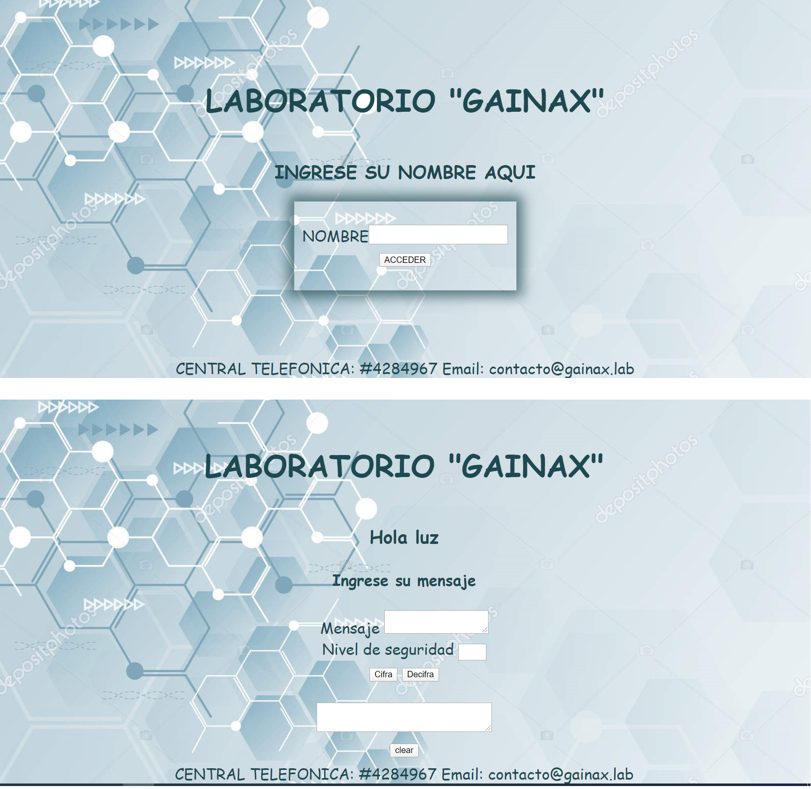
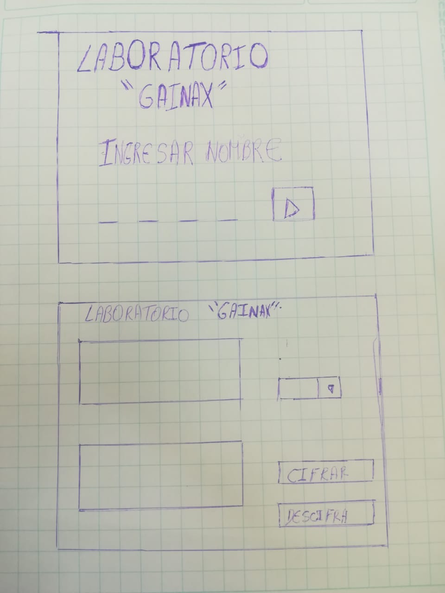

# MENSAJERIA CIFRADA DEL LABORATORIO "GAINAX" 

Investigación UX:
  1. Resumen del proyecto
    Este proyecto esta dirigido a personas que ya se encuentren trabajando en el rubro de la medicina y deseen poder enviar mensajes cifrados a otra persona de su mismo centro de labor. 

  2. Imagen final del proyecto
    

  3. Explicar cómo el producto soluciona los problemas/necesidades de dichos usuarios.

    Como es dirigido a personas que trabajan en el rubro de la salud/medicina, la mayoria son personas que crean formulas para diferente tipo de medicamentos, por ello la necesidad de escribir codificado sobre alguna inquietud a otro compañero de trabajo sin que lo demas sepan el tipo de componente tenga la nueva medicina.
 
  4. Luego colocarás la foto de tu primer prototipo en papel.
    

  5. Agregar un resumen del feedback recibido indicando las mejoras a realizar.

     Primero la idea inicial fue realizar el proyecto para ingresar a un laboratorio y el  ingreso seria a travez de la codificación cesar pero como no se entendia mucho , asi que lo modifique para que se adapte a una comunicación entre colaboradores de un mismo laboratorio, al comienzo realize el codigo con informacion antes usada("trivia"), mis compañeras me ayudaron a ver que habia otras opciones para lograr el mismo fin, asi como hacer al diseño de la pagina mas agradable . 

  6. Imagen del prototipo final.

## Índice

* [1. Resumen del proyecto](#1-resumen-del-proyecto)
* [2. Imagen final del Proyecto](#2-imagenfinal-del-proyecto)
* [4. Consideraciones generales](#3-consideraciones-generales)
* [5. Criterios de aceptación mínimos del proyecto](#5-criterios-de-aceptación-mínimos-del-proyecto)
* [6. Hacker edition](#6-hacker-edition)
* [7. Consideraciones técnicas](#7-consideraciones-técnicas)
* [8. Pistas, tips y lecturas complementarias](#8-pistas-tips-y-lecturas-complementarias)

***

## 1. Resumen del Proyecto

## 2. Imagen final del Proyecto

## 3. Investigación UX:

  1. Explicar quiénes son los usuarios y los objetivos en relación con el producto.
  2. Explicar cómo el producto soluciona los problemas/necesidades de dichos usuarios.
  3. Luego colocarás la foto de tu primer prototipo en papel.
  4. Agregar un resumen del feedback recibido indicando las mejoras a realizar.
  5. Imagen del prototipo final.

## 4. Objetivos de aprendizaje

Reflexiona y luego marca los objetivos que has llegado a **entender** y
**aplicar** en tu proyecto.

### UX

* [ ] [Diseñar la aplicación pensando y entendiendo al usuario](https://lms.laboratoria.la/cohorts/lim-2020-01-bc-core-lim012/courses/intro-ux/01-el-proceso-de-diseno/00-el-proceso-de-diseno)
* [ ] [Crear prototipos para obtener feedback e iterar](https://lms.laboratoria.la/cohorts/lim-2020-01-bc-core-lim012/courses/product-design/00-sketching/00-sketching)
* [ ] [Aplicar los principios de diseño visual](https://lms.laboratoria.la/cohorts/lim-2020-01-bc-core-lim012/courses/product-design/01-visual-design/01-visual-design-basics)

### HTML y CSS

* [ ] [Uso correcto de HTML semántico](https://developer.mozilla.org/en-US/docs/Glossary/Semantics#Semantics_in_HTML)
* [ ] [Uso de selectores de CSS](https://developer.mozilla.org/es/docs/Web/CSS/Selectores_CSS)
* [ ] [Construir tu aplicación respetando el diseño realizado](https://lms.laboratoria.la/cohorts/lim-2020-01-bc-core-lim012/courses/css/01-css/02-boxmodel-and-display) (maquetación).

### DOM

* [ ] [Uso de selectores de nodos del DOM](https://lms.laboratoria.la/cohorts/lim-2020-01-bc-core-lim012/courses/browser/02-dom/03-1-dom-methods-selection)
* [ ] [Manejo de eventos del DOM](https://lms.laboratoria.la/cohorts/lim-2020-01-bc-core-lim012/courses/browser/02-dom/04-events)
* [ ] [Manipulación dinámica del DOM](https://developer.mozilla.org/es/docs/Referencia_DOM_de_Gecko/Introducci%C3%B3n)

### Javascript

* [ ] [Manipulación de strings](https://lms.laboratoria.la/cohorts/lim-2020-01-bc-core-lim012/courses/javascript/06-strings/01-strings)
* [ ] [Uso de condicionales](https://lms.laboratoria.la/cohorts/lim-2020-01-bc-core-lim012/courses/javascript/02-flow-control/01-conditionals-and-loops)
* [ ] [Uso de bucles](https://lms.laboratoria.la/cohorts/lim-2020-01-bc-core-lim012/courses/javascript/02-flow-control/02-loops)
* [ ] [Uso de funciones](https://lms.laboratoria.la/cohorts/lim-2019-09-bc-core-lim011/courses/javascript/02-flow-control/03-functions)
* [ ] [Datos atómicos y estructurados](https://www.todojs.com/tipos-datos-javascript-es6/)
* [ ] Utilizar ES Modules (`import` | `export`).

### Testing

* [X] [Testeo de tus funciones](https://jestjs.io/docs/es-ES/getting-started)

### Git y GitHub

* [X] [Comandos de git](https://lms.laboratoria.la/cohorts/lim-2019-09-bc-core-lim011/courses/scm/01-git/04-commands)
  (`add` | `commit` | `pull` | `status` | `push`).
* [ ] [Manejo de repositorios de GitHub](https://lms.laboratoria.la/cohorts/lim-2019-09-bc-core-lim011/courses/scm/02-github/01-github)  (`clone` | `fork` | `gh-pages`).

### Buenas prácticas de desarrollo

* [ ] Organizar y dividir el código en módulos (Modularización).
* [ ] Uso de identificadores descriptivos (Nomenclatura | Semántica).
* [ ] Uso de linter para seguir buenas prácticas (ESLINT).

